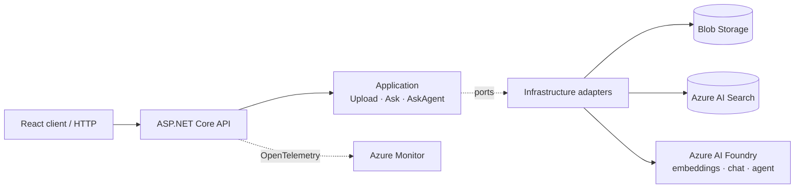

# KnowledgeAssistant

[](https://github.com/MetinTopcu/KnowledgeAssistant/actions/workflows/acr-publish.yml)
[](LICENSE)
[](https://dotnet.microsoft.com/)

**Ask questions of your own PDFs and get answers that cite their sources.**

A RAG service on Azure, built with .NET 9. It ingests PDFs, indexes them as vectors in Azure AI Search, and answers in two ways: a deterministic retrieval pipeline, and an Azure AI Foundry agent that decides for itself what to search. Every answer returns the passages it was built from.

## Highlights

- **No secrets anywhere.** Every Azure dependency authenticates with Entra ID through `DefaultAzureCredential`. There is no API key, account key or client secret in the code, the CI or the image.
- **Deployed and verified on Azure.** Runs on Azure Container Apps with a system-assigned managed identity; each RBAC role is scoped to the one resource it is for.
- **Architecture enforced by tests.** Clean Architecture with vertical slices; NetArchTest fails the build when a layer boundary is broken.
- **Two answer modes over one pipeline.** `POST /api/questions` runs one search and one grounded completion. `POST /api/questions/agent` lets a Foundry agent call the same search as a tool and reports how many searches it ran.
- **Observable and resilient.** OpenTelemetry traces, metrics and logs to Azure Monitor; separate liveness and readiness probes; Polly retries that honour `Retry-After`.
- **CI without stored credentials.** GitHub Actions builds, tests and pushes the image to Azure Container Registry over OIDC, tagged with the commit SHA.

## Architecture



Dependencies point inward only: Domain knows nothing, Application declares ports, Infrastructure implements them, and the API composes the graph. [ARCHITECTURE.md](ARCHITECTURE.md) explains each decision.

## Tech stack

**Backend:** .NET 9, ASP.NET Core, MediatR, FluentValidation, Polly, PdfPig
**Azure:** AI Foundry, AI Search, Blob Storage, Document Intelligence (optional), Container Apps, Container Registry, Azure Monitor
**Client:** React 19, TypeScript, Vite, TanStack Query, Zod, Tailwind CSS
**Quality:** xUnit, FluentAssertions, NetArchTest, OpenTelemetry, GitHub Actions

## API

| Method | Route | Does |
|---|---|---|
| `POST` | `/api/documents` | Upload a PDF (up to 20 MB); extract, chunk, embed and index it |
| `GET` | `/api/documents` | List ingested documents, newest first |
| `POST` | `/api/questions` | One vector search, one grounded answer with citations |
| `POST` | `/api/questions/agent` | Agent-driven answer with citations and `searchCount` |
| `GET` | `/health/live`, `/health/ready` | Liveness and dependency readiness |

Failures return RFC 7807 problem details with a stable `code`.

## Run locally

Requires the .NET 9 SDK, the Azure CLI, and Azure AI Search and AI Foundry resources. Blob Storage can run locally on Azurite.

```bash
git clone https://github.com/MetinTopcu/KnowledgeAssistant.git
cd KnowledgeAssistant
cp KnowledgeAssistant.Api/appsettings.Development.example.json \
   KnowledgeAssistant.Api/appsettings.Development.json   # then add your endpoints
az login
dotnet run --project KnowledgeAssistant.Api               # http://localhost:5111
```

The web client runs with `npm ci && npm run dev` in `KnowledgeAssistant.Web`. To run the production image under Docker Compose, see [CONFIGURATION.md](CONFIGURATION.md).

```bash
dotnet test KnowledgeAssistant.slnx   # unit, integration and architecture suites; no Azure needed
```

## Documentation

| | |
|---|---|
| [ARCHITECTURE.md](ARCHITECTURE.md) | Layer rules, both answer pipelines and the reasoning behind them |
| [CONFIGURATION.md](CONFIGURATION.md) | Settings, user secrets, RBAC and local sign-in |
| [DEPLOYMENT.md](DEPLOYMENT.md) | Provisioning Azure, managed identity, roles and the OIDC pipeline |
| [docs/DESIGN.md](docs/DESIGN.md) | Design specification of the web client |

## Scope

This is a portfolio project, not a service with an SLA. It has no end-user authentication (the deployed API is restricted by IP), no document delete, and it scales to zero, so the first request after idle pays a cold start.

## License

Apache License 2.0. See [LICENSE](LICENSE). Copyright 2026 Metin Topcu.
