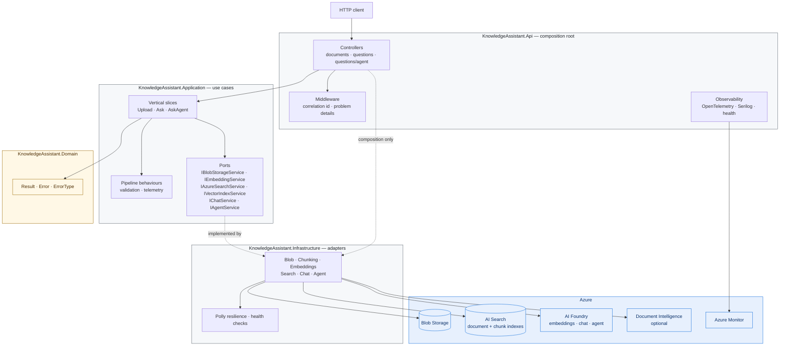
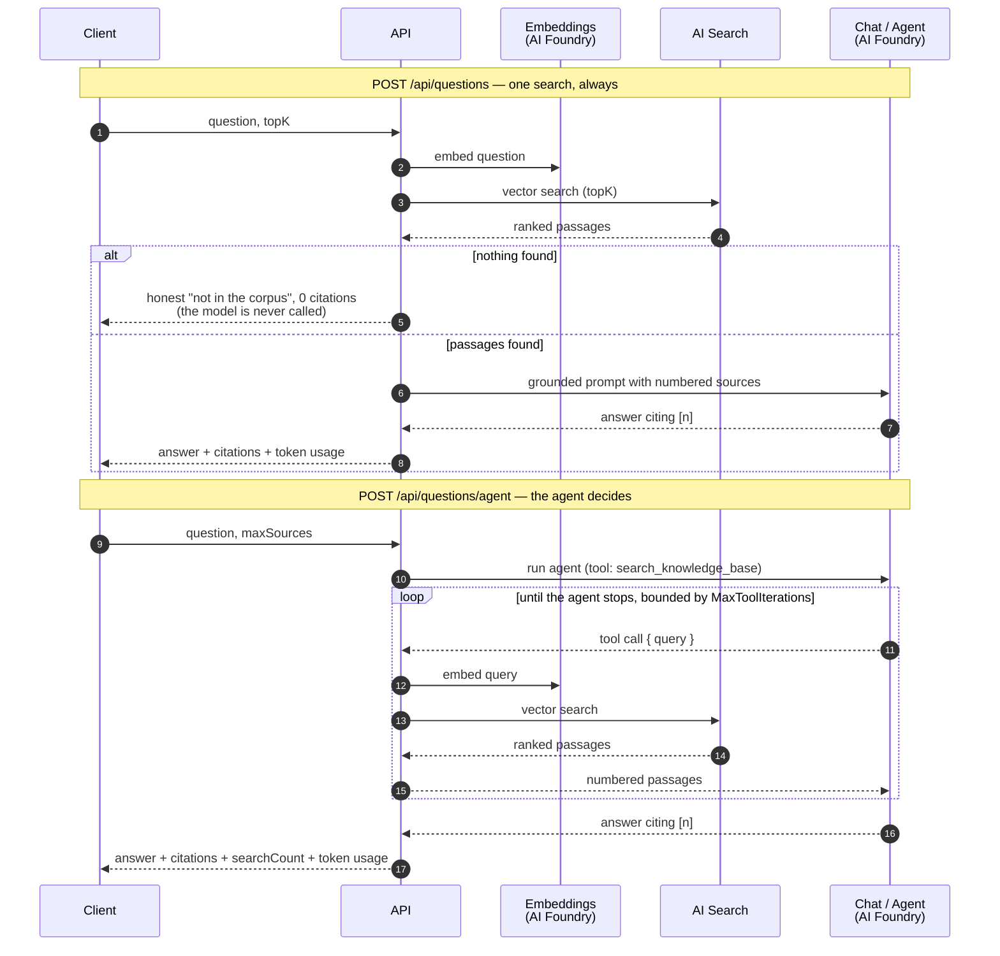

# KnowledgeAssistant

[](https://github.com/MetinTopcu/KnowledgeAssistant/actions/workflows/ci.yml)
[](LICENSE)
[](https://dotnet.microsoft.com/)

Ask questions of your own documents and get answers that cite their sources.

KnowledgeAssistant ingests PDFs, indexes them as vectors in Azure AI Search, and
answers questions two ways: a deterministic retrieval pipeline, and an Azure AI
Foundry agent that decides for itself what to look up. Every answer comes back
with the passages it was built from, so it can be checked rather than trusted.

It is written as a reference implementation of Clean Architecture and Vertical
Slice Architecture on Azure — the layer boundaries are enforced by tests, not by
convention, and **there is not a single API key or connection string in the
codebase**. Every Azure dependency authenticates with Entra ID through
`DefaultAzureCredential`.

---

## Contents

- [Features](#features)
- [Architecture](#architecture)
- [Technologies](#technologies)
- [Folder structure](#folder-structure)
- [Local setup](#local-setup)
- [API endpoints](#api-endpoints)
- [Screenshots](#screenshots)
- [Azure deployment](#azure-deployment)
- [Testing](#testing)
- [CI/CD](#cicd)
- [Documentation](#documentation)
- [License](#license)

---

## Features

**Ingestion**
- PDF upload to Azure Blob Storage, up to 20 MB
- Text extraction locally via PdfPig, or through Azure Document Intelligence for
  scanned documents when an endpoint is configured
- Overlapping chunking with deterministic, position-derived chunk ids
- Batched embeddings and vector indexing into Azure AI Search

**Retrieval — `POST /api/questions`**
- One embedding, one vector search, one grounded completion. Predictable latency
  and predictable cost
- Numbered citations that resolve to the exact text the model was shown
- Retrieving nothing is a success, not an error: the API says so and never calls
  the model

**Agent — `POST /api/questions/agent`**
- An Azure AI Foundry agent that chooses whether, how often, and with what
  wording to search
- Its knowledge source is the same RAG pipeline — the agent's one tool runs
  in-process against the same embedding and search ports
- Reports how many searches it ran, so an ungrounded answer is visible rather
  than merely plausible

**Operations**
- OpenTelemetry traces, metrics, and logs; exports to Azure Monitor or any OTLP
  collector
- Liveness and readiness probes that are deliberately different — readiness
  checks dependencies, liveness never does
- Correlation ids across logs, spans, and problem responses
- Polly retry with `Retry-After` support on every Azure AI call
- Every configuration section validated at startup, so a misconfigured deploy
  fails visibly instead of on first use

---

## Architecture

Source dependencies point inward only. Domain knows nothing; Application declares
ports; Infrastructure implements them; the API composes the graph. The arrows
below are dependencies, not call flow — control flows the opposite way at
runtime, which is the point of the ports.



### How a question is answered

The two endpoints differ in who decides what to retrieve.



`searchCount` is the field worth reading first: `0` means the agent answered
without opening the corpus at all.

See [ARCHITECTURE.md](ARCHITECTURE.md) for the reasoning behind each boundary.

---

## Technologies

| Area | Choice | Why |
|---|---|---|
| Runtime | .NET 9, ASP.NET Core | SDK pinned in `global.json` — see the note in that file |
| Mediation | MediatR 12.4.1 | Last Apache-2.0 release; v13+ requires a commercial licence |
| Validation | FluentValidation | Rules live with the slice, reachable by non-HTTP callers |
| Resilience | Polly.Core 8 | v8 pipelines only, without the deprecated v7 surface |
| Storage | Azure Blob Storage | Account URI, never a connection string |
| Retrieval | Azure AI Search | Two indexes: one per document, one per chunk |
| AI | Azure AI Foundry | Embeddings, chat, and the agent on one resource |
| PDF | PdfPig 0.1.15 | Apache-2.0; iText was rejected as AGPL |
| Telemetry | OpenTelemetry + Azure Monitor exporter | Inner layers emit through BCL types only |
| Auth | Entra ID via `DefaultAzureCredential` | No key exists, so none can leak |
| Tests | xUnit, FluentAssertions 7.2.2, NetArchTest | 7.2.2 is the last Apache-2.0 release |

---

## Folder structure

```
KnowledgeAssistant.Domain/          no dependencies at all — enforced by test
  Common/                           Result, Error, ErrorType

KnowledgeAssistant.Application/     use cases; no vendor SDK — enforced by test
  Abstractions/                     ICommand, IQuery and their handlers
  Agents/                           the agent's standing instructions
  Behaviors/                        pipeline behaviours (telemetry)
  Commands/Documents/Upload/        ingestion slice
  Queries/Documents/Ask/            retrieval slice
  Queries/Documents/AskAgent/       agent slice
  Diagnostics/                      ActivitySource, Meter, tag names
  Interfaces/                       the outbound ports

KnowledgeAssistant.Infrastructure/  the only project that knows Azure exists
  Azure/Agents/                     Foundry agent, its tool, provisioning
  Azure/Blob/                       document storage
  Azure/DocumentIntelligence/       OCR extraction (optional)
  Azure/OpenAI/                     embeddings, chat, shared retry pipeline
  Search/                           document index
  Search/Chunking/                  extraction and chunking
  Search/Vectors/                   chunk index and vector search
  Diagnostics/                      dependency health checks

KnowledgeAssistant.Api/             composition root and HTTP surface
  Controllers/                      documents, questions
  Observability/                    OpenTelemetry wiring, health endpoints
  Extensions/                       DI and Result-to-ProblemDetails mapping

tests/
  KnowledgeAssistant.Tests.Unit/          handlers, adapters, pure logic
  KnowledgeAssistant.Tests.Integration/   the real API in memory over HTTP
  KnowledgeAssistant.Tests.Architecture/  the layer rules, as executable checks
```

Most folders carry a `README.md` explaining what belongs there and why. Several
are referenced from code comments; they are documentation, not placeholders.

---

## Local setup

### Prerequisites

- **.NET 9 SDK** — `global.json` pins the 9.x line and will not roll forward to
  10.x. [Download](https://dotnet.microsoft.com/download/dotnet/9.0)
- **Azure CLI**, logged in with `az login`
- Azure resources: Blob Storage, AI Search, AI Foundry — see
  [DEPLOYMENT.md](DEPLOYMENT.md) for provisioning and the RBAC roles you need
- **Docker** (optional, for the container path)

> There is no local emulator path. Azure AI Search and AI Foundry have none, and
> adding Azurite for blob alone would mean introducing a key-based code path that
> exists only to make a demo work — the one thing this codebase's "the secret does
> not exist" guarantee is there to prevent.

### Run with the .NET CLI

```bash
git clone https://github.com/MetinTopcu/KnowledgeAssistant.git
cd KnowledgeAssistant

# Non-secret local overrides
cp KnowledgeAssistant.Api/appsettings.Development.example.json \
   KnowledgeAssistant.Api/appsettings.Development.json
# then edit it with your endpoints

az login
dotnet run --project KnowledgeAssistant.Api
```

The API listens on <http://localhost:5111>. `appsettings.Example.json` documents
every setting the service reads.

### Run with Docker Compose

```bash
cp .env.example .env        # fill in endpoints and AZURE_CONFIG_DIR
az login
docker compose up --build
```

| | |
|---|---|
| API | <http://localhost:8080> |
| Health | <http://localhost:8080/health> |
| Traces | <http://localhost:18888> (Aspire dashboard) |

Compose mounts your `az login` token cache read-only so the container
authenticates as you — there is no credential to configure.

---

## API endpoints

| Method | Route | Body | Returns |
|---|---|---|---|
| `POST` | `/api/documents` | `multipart/form-data`, field `file` (PDF, ≤ 20 MB) | document id, blob URI, chunk count |
| `POST` | `/api/questions` | `{ "question": "...", "topK": 5 }` | answer, citations, retrieved count, token usage |
| `POST` | `/api/questions/agent` | `{ "question": "...", "maxSources": 5 }` | answer, citations, **searchCount**, token usage |
| `GET` | `/health` | — | every check, for humans |
| `GET` | `/health/live` | — | process liveness; never touches a dependency |
| `GET` | `/health/ready` | — | dependency readiness; `503` when one is down |
| `GET` | `/openapi/v1.json` | — | OpenAPI document (Development only) |

Failures return [RFC 7807](https://www.rfc-editor.org/rfc/rfc7807) problem
details with a stable machine-readable `code` — branch on that, never on the
message.

```bash
# Ingest
curl -F "file=@handbook.pdf" http://localhost:8080/api/documents

# Ask — deterministic
curl -H "Content-Type: application/json" \
     -d '{"question":"What is the refund policy?","topK":5}' \
     http://localhost:8080/api/questions

# Ask — agent
curl -H "Content-Type: application/json" \
     -d '{"question":"How do refunds and returns differ?","maxSources":5}' \
     http://localhost:8080/api/questions/agent
```

`KnowledgeAssistant.Api.http` has the same requests ready to run from the IDE.

---

## Screenshots

> Placeholders — drop images into `docs/screenshots/` and they will render here.

| | |
|---|---|
| **Ingesting a document**<br/>`POST /api/documents` returning the stored blob and chunk count |  |
| **A grounded answer**<br/>`POST /api/questions` with numbered citations |  |
| **The agent at work**<br/>`POST /api/questions/agent` showing `searchCount` |  |
| **Distributed trace**<br/>One request across embedding, search, and completion |  |
| **Health**<br/>`/health` with per-dependency status |  |

---

## Azure deployment

[DEPLOYMENT.md](DEPLOYMENT.md) covers it end to end: provisioning AI Foundry, AI
Search, and Blob Storage; enabling managed identity; and the exact RBAC roles —
including the one that must go to the **search service's** identity rather than
the application's, which is the step most often missed.

The short version:

```bash
docker pull ghcr.io/metintopcu/knowledgeassistant:latest
```

Deploy to Azure Container Apps or App Service, enable a managed identity, assign
the roles, and supply the endpoints as environment variables. No secret is
involved at any point.

---

## Testing

```bash
dotnet test KnowledgeAssistant.slnx
```

| Suite | What it covers |
|---|---|
| **Unit** | Handlers, adapters, chunking, prompt construction, the agent's tool |
| **Integration** | The real API hosted in memory over HTTP, Azure ports substituted |
| **Architecture** | The layer rules — Domain depends on nothing, Application names no vendor SDK, controllers never reference Infrastructure |

The architecture suite is the one to keep. Documented rules erode; executable
ones do not — breaking a boundary is one `using` directive away and compiles
perfectly.

The integration suite needs no Azure resource, no credential, and no network,
which is why CI runs the full suite on pull requests from forks with no secrets.

---

## CI/CD

| Workflow | Trigger | Does |
|---|---|---|
| [`ci.yml`](.github/workflows/ci.yml) | every push and pull request to `master` | `dotnet build` + `dotnet test` in Release; builds the container image and smoke-tests that it serves `/health/live` |
| [`publish.yml`](.github/workflows/publish.yml) | version tag `v*.*.*`, or manual | re-runs build and test, then pushes a multi-arch image to GHCR with a signed provenance attestation |

Publishing uses the automatic `GITHUB_TOKEN` — there is no registry secret to
store or rotate, mirroring how the application itself avoids credentials.

---

## Documentation

| | |
|---|---|
| [ARCHITECTURE.md](ARCHITECTURE.md) | The layer rules, both pipelines, and the reasoning behind each decision |
| [CONFIGURATION.md](CONFIGURATION.md) | Provider precedence, user secrets, RBAC, and what `.gitignore` does and does not protect |
| [DEPLOYMENT.md](DEPLOYMENT.md) | Provisioning Azure, managed identity, and the required roles |
| `appsettings.Example.json` | Every setting the service reads, annotated |
| `.env.example` | The same, as environment variables for containers |

---

## Security

No API key, connection string, or client secret exists anywhere in this
repository — not in configuration, not in CI, not in the container image.
Everything authenticates with Entra ID through `DefaultAzureCredential`: your own
identity locally, a managed identity in Azure.

If you believe you have found a vulnerability, please open a private security
advisory rather than a public issue.

---

## License

Licensed under the Apache License, Version 2.0. See [LICENSE](LICENSE).

Copyright 2026 Metin Topcu.
