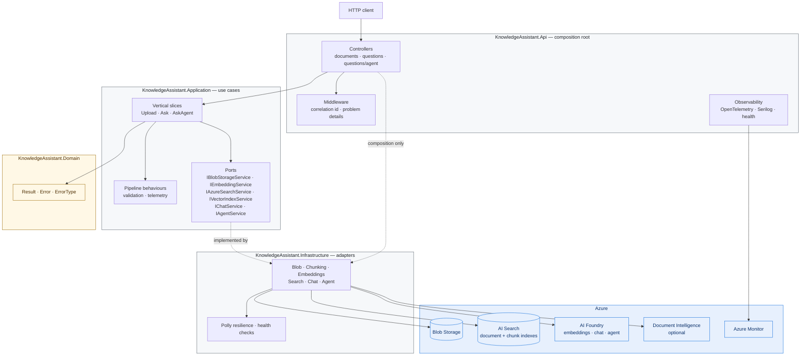
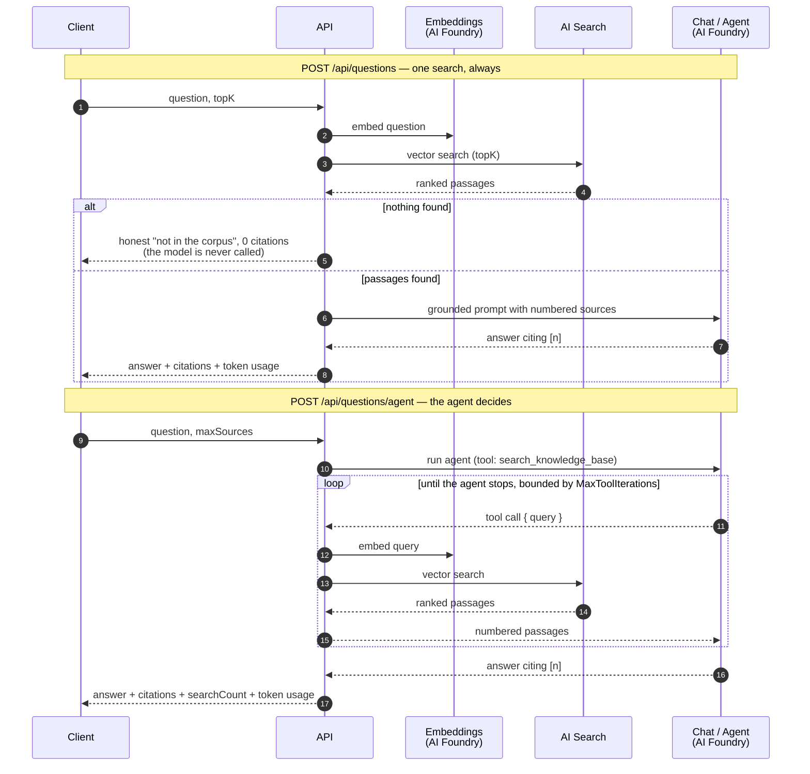

# KnowledgeAssistant

[](https://github.com/MetinTopcu/KnowledgeAssistant/actions/workflows/acr-publish.yml)
[](LICENSE)
[](https://dotnet.microsoft.com/)

Ask questions of your own documents and get answers that cite their sources.

KnowledgeAssistant ingests PDFs, indexes them as vectors in Azure AI Search, and
answers questions two ways: a deterministic retrieval pipeline, and an Azure AI
Foundry agent that decides for itself what to look up. Every answer comes back
with the passages it was built from, so it can be checked rather than trusted.

It is written as a reference implementation of Clean Architecture and Vertical
Slice Architecture on Azure — the layer boundaries are enforced by tests, not by
convention, and **there is not a single real Azure API key, account key, or
connection string in the codebase**. Every Azure dependency authenticates with
Entra ID through `DefaultAzureCredential`. The only committed connection string
is Azurite's public, Development-only `devstoreaccount1` credential for local
Blob Storage.

---

## Contents

- [Features](#features)
- [Architecture](#architecture)
- [Technologies](#technologies)
- [Folder structure](#folder-structure)
- [Local setup](#local-setup)
- [API endpoints](#api-endpoints)
- [Web client](#web-client)
- [Azure deployment](#azure-deployment)
- [Verified on Azure](#verified-on-azure)
- [Testing](#testing)
- [CI/CD](#cicd)
- [Known limitations](#known-limitations)
- [Documentation](#documentation)
- [Security](#security)
- [License](#license)

---

## Features

**Ingestion**
- PDF upload to Azure Blob Storage, up to 20 MB
- The corpus is listable: `GET /api/documents` returns what was ingested, newest first
- Text extraction locally via PdfPig, or through Azure Document Intelligence for
  scanned documents when an endpoint is configured
- Overlapping chunking with deterministic, position-derived chunk ids
- Batched embeddings and vector indexing into Azure AI Search

**Retrieval — `POST /api/questions`**
- One embedding, one vector search, one grounded completion. Predictable latency
  and predictable cost
- Numbered citations that resolve to the exact text the model was shown
- Retrieving nothing is a success, not an error: the API says so and never calls
  the model

**Agent — `POST /api/questions/agent`**
- An Azure AI Foundry agent that chooses whether, how often, and with what
  wording to search
- Its knowledge source is the same RAG pipeline — the agent's one tool runs
  in-process against the same embedding and search ports
- Reports how many searches it ran, so an ungrounded answer is visible rather
  than merely plausible

**Web client**
- A React query console over the same API: ask, agent, upload, health
- Every answer renders its passages, scores, and token usage beside it — the
  evidence is the screen, not a tooltip
- Light and dark themes, keyboard navigation, and WCAG 2.2 AA contrast

**Operations**
- OpenTelemetry traces, metrics, and logs; exports to Azure Monitor or any OTLP
  collector
- Liveness and readiness probes that are deliberately different — readiness
  checks dependencies, liveness never does
- Correlation ids across logs, spans, and problem responses
- Polly retry with `Retry-After` support on every Azure AI call
- Every configuration section validated at startup, so a misconfigured deploy
  fails visibly instead of on first use

---

## Architecture

Source dependencies point inward only. Domain knows nothing; Application declares
ports; Infrastructure implements them; the API composes the graph. The arrows
below are dependencies, not call flow — control flows the opposite way at
runtime, which is the point of the ports.



### How a question is answered

The two endpoints differ in who decides what to retrieve.



`searchCount` is the field worth reading first: `0` means the agent answered
without opening the corpus at all.

See [ARCHITECTURE.md](ARCHITECTURE.md) for the reasoning behind each boundary.

---

## Technologies

| Area | Choice | Why |
|---|---|---|
| Runtime | .NET 9, ASP.NET Core | SDK pinned in `global.json` — see the note in that file |
| Mediation | MediatR 12.4.1 | Last Apache-2.0 release; v13+ requires a commercial licence |
| Validation | FluentValidation | Rules live with the slice, reachable by non-HTTP callers |
| Resilience | Polly.Core 8 | v8 pipelines only, without the deprecated v7 surface |
| Storage | Azure Blob Storage | Account URI in Azure; Azurite connection string in Development only |
| Retrieval | Azure AI Search | Two indexes: one per document, one per chunk |
| AI | Azure AI Foundry | Embeddings, chat, and the agent on one resource |
| PDF | PdfPig 0.1.15 | Apache-2.0; iText was rejected as AGPL |
| Telemetry | OpenTelemetry + Azure Monitor exporter | Inner layers emit through BCL types only |
| Auth | Entra ID via `DefaultAzureCredential` | No real Azure key exists, so none can leak |
| Tests | xUnit, FluentAssertions 7.2.2, NetArchTest | 7.2.2 is the last Apache-2.0 release |
| Client | React 19, TypeScript, Vite | Type-checked in CI; Vite strips types without checking them |
| Client state | TanStack Query | Server state is cache, not application state |
| Client contracts | Zod | The API's shape is parsed at the boundary, so a change fails loudly |
| Styling | Tailwind CSS 4 | Tokens for both themes in one place |
| CI | GitHub Actions | Build, test, image, and an OIDC push to ACR — no stored credential |

---

## Folder structure

```
KnowledgeAssistant.Domain/          no dependencies at all — enforced by test
  Common/                           Result, Error, ErrorType

KnowledgeAssistant.Application/     use cases; no vendor SDK — enforced by test
  Abstractions/                     ICommand, IQuery and their handlers
  Agents/                           the agent's standing instructions
  Behaviors/                        pipeline behaviours (telemetry)
  Commands/Documents/Upload/        ingestion slice
  Queries/Documents/Ask/            retrieval slice
  Queries/Documents/AskAgent/       agent slice
  Diagnostics/                      ActivitySource, Meter, tag names
  Interfaces/                       the outbound ports

KnowledgeAssistant.Infrastructure/  the only project that knows Azure exists
  Azure/Agents/                     Foundry agent, its tool, provisioning
  Azure/Blob/                       document storage
  Azure/DocumentIntelligence/       OCR extraction (optional)
  Azure/OpenAI/                     embeddings, chat, shared retry pipeline
  Search/                           document index
  Search/Chunking/                  extraction and chunking
  Search/Vectors/                   chunk index and vector search
  Diagnostics/                      dependency health checks

KnowledgeAssistant.Api/             composition root and HTTP surface
  Controllers/                      documents, questions
  Observability/                    OpenTelemetry wiring, health endpoints
  Extensions/                       DI and Result-to-ProblemDetails mapping

KnowledgeAssistant.Web/             the query console (React + Vite)
  src/app/                          shell, routing, providers
  src/features/                     one folder per screen; features import no
                                    sibling feature and never reach into app/
  src/shared/                       the HTTP client, design system, hooks

tests/
  KnowledgeAssistant.Tests.Unit/          handlers, adapters, pure logic
  KnowledgeAssistant.Tests.Integration/   the real API in memory over HTTP
  KnowledgeAssistant.Tests.Architecture/  the layer rules, as executable checks

tools/
  azure-token-proxy/                DEVELOPMENT ONLY. Answers the managed
                                    identity protocol from your own az login so
                                    the production image can run under Compose
                                    with no Azure CLI in it. Never in an image
                                    that ships.
```

Most folders carry a `README.md` explaining what belongs there and why. Several
are referenced from code comments; they are documentation, not placeholders.

---

## Local setup

### Prerequisites

- **.NET 9 SDK** — `global.json` pins the 9.x line and will not roll forward to
  10.x. [Download](https://dotnet.microsoft.com/download/dotnet/9.0)
- **Azure CLI**, logged in with `az login`
- Azure resources: Blob Storage, AI Search, AI Foundry — see
  [DEPLOYMENT.md](DEPLOYMENT.md) for provisioning and the RBAC roles you need
- **Node 20.19+** (or 22.12+), for the web client — the version Vite 8 requires
- **Docker** (optional, for the container path)

> **Blob Storage can run locally on Azurite.** Set
> `Azure:Storage:ConnectionString` to `UseDevelopmentStorage=true` (and leave
> `Azure:Storage:ServiceUri` empty) to use an Azurite instance on
> `127.0.0.1:10000`; `docker compose up` starts one and points the API at it.
> The application accepts a connection string **only in the Development
> environment and only for Azurite's `devstoreaccount1` with its published key**,
> so no real account key can take this path. Every deployed environment keeps
> `ServiceUri` + `DefaultAzureCredential`. Azure AI Search and AI Foundry have no
> emulator and still need real resources.

### Run with the .NET CLI

```bash
git clone https://github.com/MetinTopcu/KnowledgeAssistant.git
cd KnowledgeAssistant

# Non-secret local overrides
cp KnowledgeAssistant.Api/appsettings.Development.example.json \
   KnowledgeAssistant.Api/appsettings.Development.json
# then edit it with your endpoints

az login
dotnet run --project KnowledgeAssistant.Api
```

The API listens on <http://localhost:5111>. `appsettings.Example.json` documents
every setting the service reads.

### Run with Docker Compose

```bash
cp .env.example .env        # fill in endpoints and a random IDENTITY_HEADER
docker compose run --rm azure-token-proxy az login --use-device-code   # once
docker compose up --build
```

| | |
|---|---|
| API | <http://localhost:8080> |
| Health | <http://localhost:8080/health> |
| Traces | <http://localhost:18888> (Aspire dashboard) |
| Azurite (Blob) | <http://localhost:10000/devstoreaccount1> |

The API container is the production image — no Azure CLI in it. Under Compose it
authenticates with `ManagedIdentityCredential`, answered by `azure-token-proxy`,
a dev-only container (`tools/azure-token-proxy`) that holds **your** `az login`
in a Docker volume and speaks the managed identity protocol. No secret is baked
into an image and the host's token cache is never mounted. It reproduces the
credential type used in Azure, not Azure's identity: calls run as you, with your
roles. See [CONFIGURATION.md](CONFIGURATION.md#sign-in-with-the-azure-cli).

---

## API endpoints

| Method | Route | Body | Returns |
|---|---|---|---|
| `POST` | `/api/documents` | `multipart/form-data`, field `file` (PDF, ≤ 20 MB) | document id, blob URI, chunk count |
| `GET` | `/api/documents` | `?maxResults=50` (optional, ≤ 200) | the corpus, newest first: id, file name, blob name, ingested time |
| `POST` | `/api/questions` | `{ "question": "...", "topK": 5 }` | answer, citations, retrieved count, token usage |
| `POST` | `/api/questions/agent` | `{ "question": "...", "maxSources": 5 }` | answer, citations, **searchCount**, token usage |
| `GET` | `/health` | — | every check, for humans |
| `GET` | `/health/live` | — | process liveness; never touches a dependency |
| `GET` | `/health/ready` | — | dependency readiness; `503` when one is down |
| `GET` | `/openapi/v1.json` | — | OpenAPI document (Development only) |

Failures return [RFC 7807](https://www.rfc-editor.org/rfc/rfc7807) problem
details with a stable machine-readable `code` — branch on that, never on the
message.

```bash
# Ingest
curl -F "file=@handbook.pdf" http://localhost:8080/api/documents

# Ask — deterministic
curl -H "Content-Type: application/json" \
     -d '{"question":"What is the refund policy?","topK":5}' \
     http://localhost:8080/api/questions

# Ask — agent
curl -H "Content-Type: application/json" \
     -d '{"question":"How do refunds and returns differ?","maxSources":5}' \
     http://localhost:8080/api/questions/agent
```

`KnowledgeAssistant.Api.http` has the same requests ready to run from the IDE.

---

## Web client

`KnowledgeAssistant.Web` is a React query console over the same API — not a chat
client, because `POST /api/questions` keeps no conversation between calls and
rendering a thread would imply a memory the server does not have.

| Screen | What it does |
|---|---|
| **Ask** | One question, one search, one grounded answer — with every passage it was given, its score, and the token usage |
| **Agent** | The same question through the Foundry agent, showing `searchCount`: `0` means it answered without opening the corpus |
| **Documents** | The ingested corpus from `GET /api/documents`, newest first, sortable |
| **Health** | `/health` per dependency, live |
| **Settings** | The build's environment, region, timeout, theme, and accessibility preferences |

```bash
cd KnowledgeAssistant.Web
npm ci
npm run dev     # http://localhost:5173, proxying /api and /health to the API
```

The dev server proxies rather than sending cross-origin requests: the API
configures no CORS policy, and opening one so a dev server can reach it would
put a permanent hole in the production surface to solve a local problem.
[`KnowledgeAssistant.Web/README.md`](KnowledgeAssistant.Web/README.md) covers the
scripts and the feature-folder rules; [`docs/DESIGN.md`](docs/DESIGN.md) is the
design specification the client implements.

No screenshots are committed. `docs/screenshots/README.md` says what to capture
and what to redact first.

---

## Azure deployment

[DEPLOYMENT.md](DEPLOYMENT.md) covers it end to end: provisioning AI Foundry, AI
Search, and Blob Storage; enabling the application's managed identity; the exact
RBAC roles; and the configuration each resource needs.

The short version: build the image from this repository's `Dockerfile`, push it
to a container registry, then deploy it to Azure Container Apps or App Service,
enable a managed identity, assign the roles, and supply the endpoints as
environment variables. No secret is involved at any point — the app pulls its
own image with `AcrPull` and reaches every Azure dependency with the same
identity.

```bash
docker build -t $ACR.azurecr.io/knowledge-assistant-api:$TAG .
az acr login -n $ACR && docker push $ACR.azurecr.io/knowledge-assistant-api:$TAG
```

CI does this build and push for you on every push to `master`
([CI/CD](#cicd)). **Deploying the result is a deliberate manual step** — see
below.

---

## Verified on Azure

The deployment is real and was exercised end to end, with the Container App's
own system-assigned managed identity and no key anywhere in the path:

| | |
|---|---|
| **Host** | Azure Container Apps, Consumption plan, scale to zero (`min 0 / max 1`), ingress restricted to a single IP |
| **Registry** | An existing Basic-tier ACR. Admin user disabled; the app pulls with `AcrPull` |
| **Identity** | System-assigned managed identity holding `Storage Blob Data Contributor`, `Search Index Data Contributor`, `Search Service Contributor`, `Azure AI User`, `AcrPull`, and `Monitoring Metrics Publisher` — each scoped to the one resource it is for |
| **Ingestion** | A PDF uploaded through `POST /api/documents` reached Blob Storage, was extracted, chunked, embedded, and indexed |
| **Retrieval** | `POST /api/questions` answered from that document with citations resolving to the indexed passages |
| **Agent** | `POST /api/questions/agent` ran against the pinned agent version, whose stored definition fingerprint was verified to match the deployed build |
| **Telemetry** | Application Insights recorded the run, including the managed identity token acquisition |

This is a portfolio deployment, not a service with an SLA. It scales to zero, it
is reachable from one address, and it has no user authentication — see
[Known limitations](#known-limitations).

---

## Testing

```bash
dotnet test KnowledgeAssistant.slnx
```

| Suite | What it covers |
|---|---|
| **Unit** | Handlers, adapters, chunking, prompt construction, the agent's tool |
| **Integration** | The real API hosted in memory over HTTP, Azure ports substituted |
| **Architecture** | The layer rules — Domain depends on nothing, Application names no vendor SDK, controllers never reference Infrastructure |

The architecture suite is the one to keep. Documented rules erode; executable
ones do not — breaking a boundary is one `using` directive away and compiles
perfectly.

The integration suite needs no Azure resource, no credential, and no network,
which is why CI runs the full suite on pull requests from forks with no secrets.

---

## CI/CD

| Workflow | Trigger | Does |
|---|---|---|
| [`ci.yml`](.github/workflows/ci.yml) | every pull request to `master`; called by `acr-publish.yml` | `dotnet build` + `dotnet test` in Release; lint, type-check and build the web client; build the container image and smoke-test that it serves `/health/live` |
| [`acr-publish.yml`](.github/workflows/acr-publish.yml) | every push to `master`, or manual | runs `ci.yml` for the commit, then builds the image and pushes it to the existing **Azure Container Registry** under an immutable commit-SHA tag |

Two workflows, one set of checks: the validation steps live only in `ci.yml`,
and `acr-publish.yml` calls it rather than copying it, so a `master` commit is
validated once and the checks that gate a pull request are exactly the checks
that gate an image.

**Every push to `master` is validated, and a successful build is published to
Azure Container Registry as `<registry>.azurecr.io/knowledge-assistant-api:<commit-sha>`.**

### This is not continuous deployment

The pipeline ends at the registry push. It never calls `az containerapp update`,
never restarts a revision, and never changes ingress, scale, or any other Azure
resource — the Container App keeps running the image it was last given until a
human points it at a new tag. Publishing an image is a claim that the code
builds and its tests pass; deploying is a claim that somebody is ready for it to
be live, and this repository only makes the first one automatically.

### How it authenticates: OIDC, no stored credential

`acr-publish.yml` signs in with **GitHub OIDC federated with Entra ID**. The
runner exchanges the short-lived token GitHub mints for this repository and
branch for an Azure token; there is no client secret, no service principal
password, and no registry password. The registry's admin user stays disabled.

The federated identity holds exactly one role — `AcrPush`, scoped to that one
registry. It cannot deploy, restart, read Blob or Search, or create anything.
The workflow's GitHub permissions are `contents: read`, plus `id-token: write`
on the one job that signs in to Azure, and nothing else. The three repository secrets it reads
(`AZURE_CLIENT_ID`, `AZURE_TENANT_ID`, `AZURE_SUBSCRIPTION_ID`) are identifiers,
not credentials. [DEPLOYMENT.md](DEPLOYMENT.md) §8 has the commands that set
this up.

Image tags are the full commit SHA and nothing else. A moving `latest` is
deliberately absent: every image traces to the commit that produced it, and no
later run can move a tag out from under a revision that is already running.

---

## Known limitations

Stated rather than hidden, because a portfolio project that claims to be finished
is less believable than one that says where it stops.

| Limitation | Detail |
|---|---|
| **No user authentication** | `DefaultAzureCredential` authenticates the *service to Azure*, not a *user to the service*. The deployed API is protected by an IP restriction on Container Apps ingress, which is a fence, not an identity. Entra ID at the platform edge plus a validated bearer token is the intended answer |
| **The listing shows only what the index stores** | `GET /api/documents` returns id, file name, blob name, and ingestion time. Size, content type, and chunk count are reported at upload but never persisted, so the list cannot show them without an index schema change and a corpus rebuild |
| **No paging** | The listing returns one page, newest first, and says whether it filled the limit. A cursor is a promise about ordering under concurrent writes that this index cannot make |
| **No delete or re-ingest** | A document can be uploaded, not removed. Clearing the corpus means recreating the indexes |
| **Azure AI Search Free tier** | Occasionally returns fewer than `topK` vector matches even with an exhaustive query. Cause not established; it has not reproduced on demand. The Free tier is also capped at 3 indexes and 50 MB |
| **Scale to zero** | The Container App runs `min 0`, so the first request after an idle period pays a cold start of several seconds |
| **Chunking is not versioned** | Chunk ids derive from position, so changing `Chunking:MaxChunkSize` or `OverlapSize` invalidates every chunk already indexed. Treat a change as a corpus rebuild |
| **No run history** | Answers are not persisted; the client keeps the current run only |

---

## Documentation

| | |
|---|---|
| [ARCHITECTURE.md](ARCHITECTURE.md) | The layer rules, both pipelines, and the reasoning behind each decision |
| [CONFIGURATION.md](CONFIGURATION.md) | Provider precedence, user secrets, RBAC, and what `.gitignore` does and does not protect |
| [DEPLOYMENT.md](DEPLOYMENT.md) | Provisioning Azure, managed identity, and the required roles |
| [docs/DESIGN.md](docs/DESIGN.md) | The client's design specification: users, screens, tokens, accessibility |
| [KnowledgeAssistant.Web/README.md](KnowledgeAssistant.Web/README.md) | Running the client, its scripts, and its feature-folder rules |
| `appsettings.Example.json` | Every setting the service reads, annotated |
| `.env.example` | The same, as environment variables for containers |

---

## Security

No real Azure API key, account key, connection string, or client secret exists
anywhere in this repository — not in configuration, not in CI, not in the
container image. Every Azure resource is reached with Entra ID: a managed
identity through `DefaultAzureCredential` in Azure, and your own identity
locally — the Azure CLI login for `dotnet run`, or the dev-only token proxy under
Docker Compose.

The one exception is local Blob Storage. `docker-compose.yml` and
`appsettings.Development.example.json` configure Azurite with its standard public
`devstoreaccount1` credential, which is not a secret. The application accepts that
connection string only in the Development environment and only for Azurite's
account and published key, so no real Azure account key can be used through it.

If you believe you have found a vulnerability, please open a private security
advisory rather than a public issue.

---

## License

Licensed under the Apache License, Version 2.0. See [LICENSE](LICENSE).

Copyright 2026 Metin Topcu.
